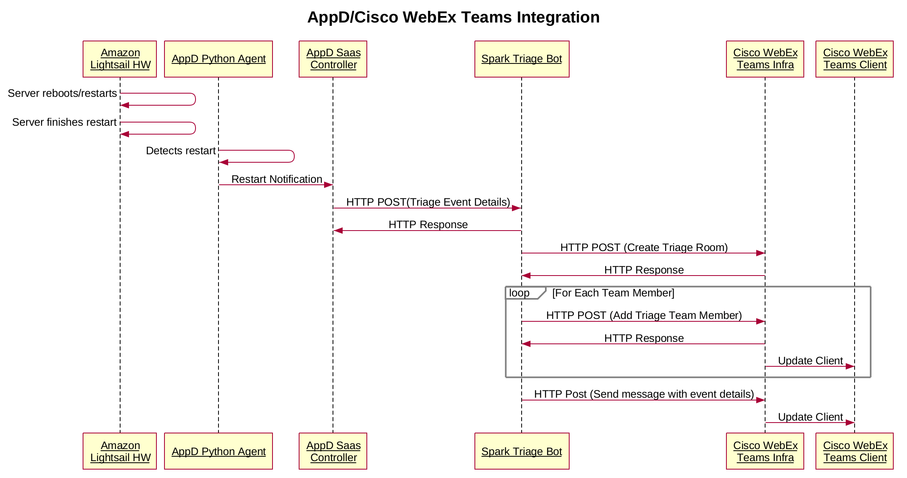

# AppDynamics Triage Bot

Recently I've had the opportunity to get to work with the powerful tools that [AppDynamics](https://www.appdynamics.com) has to offer.  In addition to automatically and dynamically mappig out your application flow, business transaction scoring and correlation, AppDynamics has a [powerful monitoring and alert system](https://blog.appdynamics.com/product/proactive-monitoring-and-alerting-with-appdynamics/).  Like other monitoring systems you are able to send out SMS or email alerts based upon various criteria.  What is really cool is that the App D controller can fire HTTP requests at a web server!  This opens up a variety of use cases like a Cisco Spark Bot that creates a Triage Spark Room complete with pre-populating team room members, posting links and logs and other information necessary to hit the ground running in triaging the issue.

## Problem meet Triage Bot

I already have AppD monitoring a couple of my own Spark Bots, so let's setup App Dynamics and a Spark Bot to do the following in case a server I'm monitoring restarts.  Here is a high level view of the architecture.


When AppD discovers a restart, I would like the following to happen:
1. AppD send an HTTP request to a Spark Bot we'll call AppD Triage Bot.  The body of the request should include:
   * List of team members to be added to the Spark room
   * Issue name and description
   * Link to more information on the App D controller
2. Upon receipt of the a valid HTTP request, the AppD Triage Bot will:
   * Create the spark room
   * Populate the spark room with team members
   * Post an informative message to the spark room so that the team understands what is going on, and
   * Provide a deep link to more relevant information on the AppD controller.

Here is a high-level view of the call flow.



## What We are Doing

So let's dive into how this done.

In order for the monitor and alert functionality to work on AppD, you need to create a Policy that defines the criteria that you want to monitor and the action that you want to take.  


The monitoring criteria can be performance metrics, health rules related to business transaction performance or specific events like a server restart.  It can really be anything you like.  For example, say some of your business transactions start slowing down to unacceptable level.  Trigger the alert!  For the sake of simplicity, I've decided to go with a simple server restart.

In order to take action with an HTTP Request, we first have to define an HTTP Request Template.  With the policy and HTTP Request defined for our case, when a server that we are monitoring restarts, the AppD controller will fire an HTTP Request to our AppD Triage Bot.

Creating an HTTP Request Template is fairly straight forward and I'd recommend checking out the documentation for a quick primer.  The main things you will need to fill out in the form includes:
* Name of the Template,
* URL of the Spark Bot Web Server,
* Both the "Accept" and "Content-Type" request headers,
* Add your own customer header called **Triage-Auth-Token**.  This header is populated with a secret token that should be stored in an environmental variable on you bot server.  It is used to authenticate your webhook
* Payload MIME Type, and
* Payload JSON

It is this HTTP Request Payload that we need to customize that will allow us to really differentiate our bot and provide a lot of context to our Spark triage room.  The body will be a JSON dictionary that will contain the following:
* An array of team members that the bot will populate the room with, and
* An array of events that have triggered the alert HTTP Request

The team members are pretty easily populated, but how do we get events?  Well, fortunately, the gurus at AppD allow scripting of the [HTTP Template Request Body](https://docs.appdynamics.com/display/PRO44/HTTP+Request+Actions+and+Templates#HTTPRequestActionsandTemplates-CreateorModifyanHTTPRequestTemplate) via [Apache Velocity] (http://velocity.apache.org).  In a nutshell, the Apache Velocity Templating language allows us to populate the contents of the request body at alert time so that we have the most up to date contextual information possible.

here is the body snippet for the payload template

```json
{
    "triageEmailList": [
    "superawesomeuser@yourgreatcompany.com",
    "supersupportguy@yourgreatcompany.com"
    ],
    "events": [
#foreach(${event} in ${fullEventList})
   #set( $msg = $event.summaryMessage.replace("
", "\\n") )
    {
      "app": "${event.application.name}",
       "appid": "${event.application.id}",
       "tier": "${event.tier.name}",
       "node": "${event.node.name}",
       "time": "${event.eventTime}",
       "deeplink": "${event.deepLink}",
       "name": "${event.displayName}",
       "severity": "${event.severity}",
       "message": "${msg}"
   }
   #if($velocityCount != $fullEventList.size()) , #end
#end
    ]
}
```

Let's break it down.  The first dictionary entry, triageEmailList, is the list of team members we want to add to the room.  The second dictionary entry is the list of events that generated the alert.  Velocity allows us to script this into a set of key/value pairs that the Triage Bot can process and build a contextually relevant message for the triage room.  As you can see from the listing, we can provide a bunch of information including the specific application name, the name of the alert, it's severity, alert message info.  Most importantly there is a deep link provided that allows the team to immediately start looking into the issue at hand.

When the HTTP Request is fired, the JSON body looks something like this:

The resulting JSON body looks like this:

```
{
"events": [
        {
            "app": "Super Awesome Spark Bot",
            "appid": "505",
            "deeplink": "https://xyz.saas.appdynamics.com/#location=APP_EVENT_VIEWER_MODAL&eventSummary=132914372&application=505",
            "message": "Proxy was re-started Node: node afc0, Tier: Web Server",
            "name": "App Server Restart",
            "node": "node afc0",
            "severity": "INFO",
            "tier": "Web Server",
            "time": "Thu Jan 11 09:51:25 PST 2018"
        }
    ],
    "triageEmailList": [
        "superawesomeuser@yourgreatcompany.com",
        "supersupportguy@yourgreatcompany.com"
    ]
}

```

## The Code

Now lets look at the AppD triage Bot Code.  It is a simple Python based Flask application that takes the request, parses the JSON payload, and creates the Spark room.  So lets break down the code.

The first part is standard Flask stuff:

```python

@app.route('/appdtriagebot', methods =['POST'])
def triage_room_required():
    date_time = dt.datetime.now()

    if verify_incoming_request(request):
        request_json = request.json
        build_triage_room(request_json)
    else:
        print("{}, POST request was NOT successfully verified.".format(date_time))

    return "Ok"

if __name__ == "__main__":
    app.run(host='0.0.0.0')
```

pretty simple.  We take the HTTP request, verify it's coming from out AppD controller via a token embedded in the request and then fire a function, build_triage_room, that takes the request payload and builds the room.  Now let's take a look at how we build the room:

```python
def build_triage_room(appd_request_json):

    the_url = "https://api.ciscospark.com/v1/rooms"
    date_time = dt.datetime.now()
    print("{}, build_triage_room start".format(date_time))

    # Get the event from the request json
    event = appd_request_json['events'][0]

    # Get the app name from the event
    app_name = event['app']

    # Create the title of the room from the app name we just pulled
    message_json = {"title": "AppD: {} Triage".format(app_name)}

    #Grab our bot_token that we stored in the environment because it's not a good thing to store it in code.
    bot_token = os.environ.get('APPD_TRIAGE_BOT_ACCESS_TOKEN')

    # Create the HTTP Post for creating the triage room
    message_response = requests.post(the_url, json=message_json, verify=True, headers={'Authorization': 'Bearer {}'.format(bot_token),'Accept':
                                                                   'application/json'})

    # Handle potential errors gracefully.  In this case just print something to STDOUT
    if message_response.status_code==200:
        message_response_json = json.loads(message_response.text)
        date_time = dt.datetime.now()
        print("{}: Success, message response json: {}".format(date_time,json.dumps(message_response_json, sort_keys=True, indent=4)))

        # Creating the room was successful.  Now we need to populate the room with people necessary to triage it.

        #
        # First we need the room id of the room we just created.
        room_id = message_response_json['id']

        date_time = dt.datetime.now()

        print("{}:   room_Id: {}".format(date_time, room_id))

        # We get that list of people from the json message.

        email_list = appd_request_json['triageEmailList']

        the_url = "https://api.ciscospark.com/v1/memberships"

        # Iterage through the mail list.
        for email_address in email_list:
            message_json = {"roomId": room_id,
                            "personEmail": email_address}
            print("{},   sending request to add folks to the room".format(date_time))
            message_response = requests.post(the_url, json=message_json, verify=True,
                                             headers={'Authorization': 'Bearer {}'.format(bot_token), 'Accept':
                                                 'application/json'})
            if message_response.status_code == 200:
                date_time = dt.datetime.now()
                print("{}: Successfully added {} to the room!".format(date_time, email_address))
            else:
                date_time = dt.datetime.now()
                print("{}: DID NOT Successfully added {} to the room!.  Status Code: {}".format(date_time, email_address, message_response.status_code))

        # Retrieve the event that caused this and post it as a message to the room
        # Post to the room
        date_time = dt.datetime.now()
        print("{}: Posting event info to the room".format(date_time))

        events = appd_request_json['events']
        event = appd_request_json['events'][0]

        app_name = event['app']
        event_name = event['name']
        event_summary = event['message']
        event_deep_link_url = event['deeplink']

        post_url = "https://api.ciscospark.com/v1/messages"

        # Going crazy with the mark down, but the message should look good.
        # We could also potentially post other stuff here, like logs or similar.  But you get the idea.
        post_data = {'roomId': room_id, 'markdown': "## **{}** Had a Major Application Event!! \n\n * **Application Event:**  _{}_\n\n* **Event Summary:** {}\n\n * The event can be found here: {}".format(app_name, event_name, event_summary, event_deep_link_url)}

        print("{}:      info posting to the room: {}".format(date_time,
                                                              json.dumps(post_data, sort_keys=True,
                                                                         indent=4)))

        request_response_results = requests.post(post_url, json=post_data, headers={"Accept": "application/json",
                                                                                    "Content-Type": "application/json",
                                                                                    "Authorization": "Bearer {}".format(
                                                                                        bot_token)})

        if request_response_results.status_code == 200:
            date_time = dt.datetime.now()
            print("{}: Successfully posted the event to the room!".format(date_time, email_address))
        else:
            date_time = dt.datetime.now()
            print("{}: DID NOT Successfully post to the room!.  Status Code: {}".format(date_time,
                                                                                        message_response.status_code))

    else:
        date_time = dt.datetime.now()
        print("{}: failure, received status code: {}".format(date_time, message_response.status_code))

    date_time = dt.datetime.now()
    print("{}, build_triage_room end".format(date_time))

```

Here is a screenshot of the finished product!
